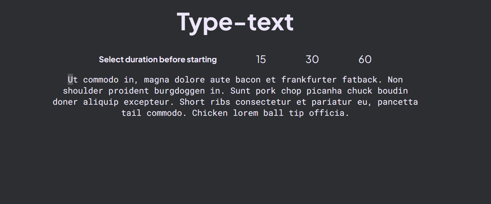

# TypeTest

Test your typing speed with this Angular-based application. You can visit site [here🔗](https://type-test-phi.vercel.app/)

## Screenshot



## Getting Started

### Prerequisites
- Node.js
- Angular CLI

### Installation
1. Clone the repo:
   ```sh
   git clone https://github.com/shubhamashish33/type-test.git
   ```
2. Install dependencies:
   ```sh
   npm install
   ```

### Running the App
- Development server:
  ```sh
  ng serve
  ```
  Navigate to `http://localhost:4200/`.

### Building the App
- Production build:
  ```sh
  ng build --prod
  ```

### Testing
- Unit tests:
  ```sh
  ng test
  ```
- End-to-end tests:
  ```sh
  ng e2e
  ```

## Usage
Generate components and services using Angular CLI commands.

## License
Distributed under the MIT License. See `LICENSE` for more information.
